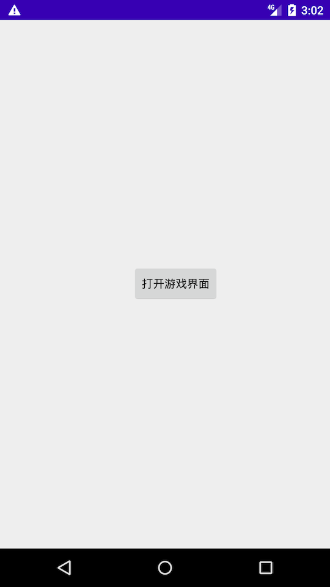
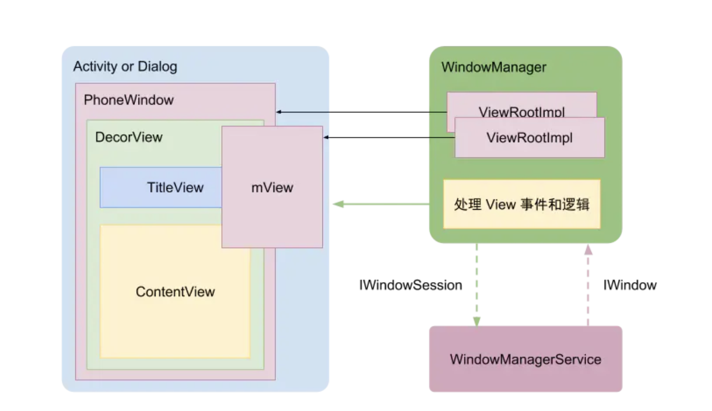
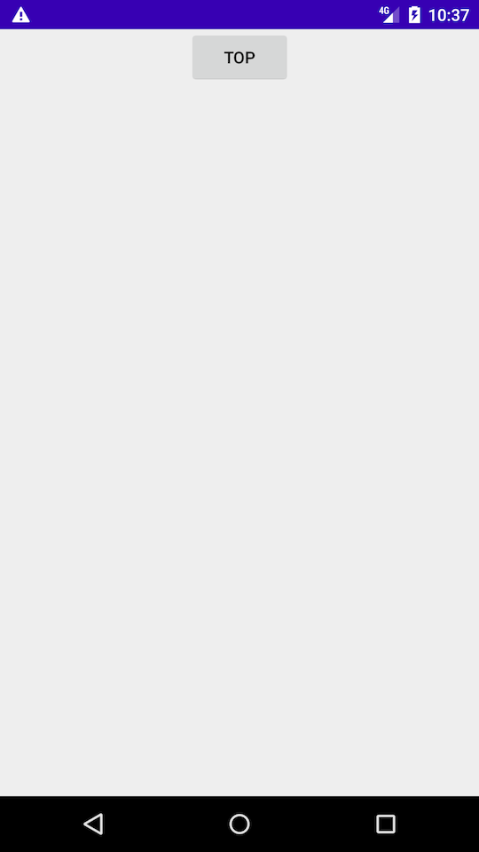

# 状态栏知识

## 基本概念


* 状态栏（StatusBar）：指屏幕最顶端，显示时间、电量、推送图标那一栏，每个手机都有状态栏。

  

* 标题栏（TitleBar）：指状态栏下，显示“返回键”、“标题文字”那一栏，根据需求而定是否有标题栏，标题栏可以使用 `Toolbar` 或者 `ActionBar` 控件实现

  

* 导航栏（NavigationBar)：指屏幕最下端，有“返回键”、“Home键”、”菜单键“那一栏。导航栏是虚拟的，不是每个手机都有的。

| 属性               | 说明           |      |
| ------------------ | -------------- | ---- |
| ColorPrimaryDark   | 状态栏颜色     |      |
| ColorPrimary       | ToolBar颜色    |      |
| navigationBarColor | 导航栏颜色     |      |
| windowBackground   | 窗口背景       |      |
| textColorPrimary   | 工具栏文字颜色 |      |


### 布局分析

```xml
//主题样式   
<style name="AppTheme" parent="Theme.AppCompat.Light.NoActionBar">
        <!-- Customize your theme here. -->
        <item name="colorPrimary">@color/colorPrimary</item>
        <item name="colorPrimaryDark">@color/colorPrimaryDark</item>
        <item name="colorAccent">@color/colorAccent</item>
</style>

<activity
      android:name=".MainActivity"
      android:screenOrientation="portrait">
      <intent-filter>
           <action android:name="android.intent.action.MAIN" />

           <category android:name="android.intent.category.LAUNCHER" />
      </intent-filter>
</activity>
```

1）5.0 应用截图




2） system ui 布局


3）应用布局


**总结**：

* statusBar和navigationBar属于SystemUI窗口
* statusBar和navigationBar背景属于App来管理


### 布局加载流程

**1）Activity、Window、View关系** 



* **Activity** ：本身不是窗口，也不是视图，它只是窗口的载体，一方面是key、touch事件的响应处理，一方面是对界面生命周期做统一调度 
* **Window**：一个顶级窗口查看和行为的一个抽象基类。它也是装载View的原始容器， 处理一些应用窗口通用的逻辑。使用时用到的是它的唯一实现类：PhoneWindow。Window受WindowManager统一管理
* **DecorView**：顶级视图，一般情况下它内部会包含一个竖直方向的LinearLayout，上面的标题栏(titleBar)，下面是内容栏。通常我们在Activity中通过setContentView所设置的布局文件就是被加载到id为android.R.id.content的内容栏里(FrameLayout)。


**2）Activity和Window生命周期**


**3) 布局加载关键代码分析**

* setConteView

```java
  // Activity.java 
  public void setContentView(@LayoutRes int layoutResID) { 
          getWindow().setContentView(layoutResID);
          initWindowDecorActionBar();
   }
  
  
  //PhoneWindow
      @Override
      public void setContentView(int layoutResID) {
          if (mContentParent == null) {
            //1.初始化
            //创建DecorView对象和mContentParent对象 ,并将mContentParent关联到DecorView上
             installDecor();
          } else if (!hasFeature(FEATURE_CONTENT_TRANSITIONS)) {
              mContentParent.removeAllViews();//Activity转场动画相关
          }
  
          //2.填充Layout
          if (hasFeature(FEATURE_CONTENT_TRANSITIONS)) {
              final Scene newScene = Scene.getSceneForLayout(mContentParent, layoutResID, getContext());
              transitionTo(newScene);//Activity转场动画相关
          } else {
               //将Activity设置的布局文件，加载到mContentParent中
              mLayoutInflater.inflate(layoutResID, mContentParent);
          }
  
          //让DecorView的内容区域延伸到systemUi下方，防止在扩展时被覆盖，达到全屏、沉浸等不同体验效果。
          mContentParent.requestApplyInsets();
  
          //3. 通知Activity布局改变
          final Callback cb = getCallback();
          if (cb != null && !isDestroyed()) {
  
          //触发Activity的onContentChanged方法  
           cb.onContentChanged();
          }
          mContentParentExplicitlySet = true;
      }
  
```


* **installDecor**

```java
//PhoneWindow
private void installDecor() {
    mForceDecorInstall = false;
    if (mDecor == null) {
        mDecor = generateDecor(-1);// 创建 DecorView
        mDecor.setDescendantFocusability(ViewGroup.FOCUS_AFTER_DESCENDANTS);
        mDecor.setIsRootNamespace(true);
        if (!mInvalidatePanelMenuPosted && mInvalidatePanelMenuFeatures != 0) {
            mDecor.postOnAnimation(mInvalidatePanelMenuRunnable);
        }
    } else {
        mDecor.setWindow(this);
    }
  
    if (mContentParent == null) {
         //根据窗口的风格修饰，选择对应的修饰布局文件，并且将id为content的FrameLayout赋值给mContentParent 
        mContentParent = generateLayout(mDecor);
       …  //初始化一堆属性值
    }
}

protected ViewGroup generateLayout(DecorView decor) {
   //1,为Activity配置相应属性，即android：theme=“”，PhoneWindow对象调用getWindowStyle()方法获取值。
   TypedArray a = getWindowStyle();
    ...
   //2,获取窗口Features, 设置相应的修饰布局文件，这些xml文件位于frameworks/base/core/res/res/layout下
   int layoutResource;
   int features = getLocalFeatures();//指定requestFeature()指定窗口修饰符，PhoneWindow对象调用getLocalFeature()方法获取值；
    ...
    mDecor.startChanging();
    //3, 将上面选定的布局文件inflate为View树，添加到decorView中
   mDecor.onResourcesLoaded(mLayoutInflater, layoutResource);
    //4,将窗口修饰布局文件中id="@android:id/content"的View赋值给mContentParent, 后续自定义的view/layout都将是其子View
   ViewGroup contentParent = (ViewGroup)findViewById(ID_ANDROID_CONTENT);
    ...
    mDecor.finishChanging();
   return contentParent;
}
```


**installDecor() 做了这么几件事：**

1） 创建一个DecorView的对象mDecor，该mDecor对象将作为整个应用窗口的根视图。
**2） 配置不同窗口修饰属性（style theme等）。**
3） 将DecorView布局中id为content的FrameLayou的Viewt赋值给mContentParent
至此，DecorView 的 contentView 大容器已经设置完成， 但是里面并没有内容，原因是用户自定义的xml文件还没有解析加载到contentView上。


参考 ：

[Window加载视图过程](https://www.jianshu.com/p/b3a1ea7923e7)

[DecorView布局加载流程](https://www.jianshu.com/p/c2b38bada5ba)

[setSystemUiVisibility的流程](https://blog.csdn.net/Rodulf/article/details/84642332)

## 状态栏变迁

* Android 4.4 以下，Android 的状态栏是黑色背景，**无法修改**。


* android4.4 推出了**透明状态栏**，**“沉浸状态栏”准确说就是透明栏**。


* android5.0 系统才真正的支持状态栏变色，系统加入了一个重要的属性和方法 android:statusBarColor （对应方法为 setStatusBarColor），通过这个属性可以直接设置状态栏的颜色


* 在android6.0上主要就是添加了一个功能可以修改状态栏上内容和图标的颜色（黑色和白色）


## 状态栏颜色设置

### android4.4设置

**设置方式**：

通过设置Window的**FLAG_TRANSLUCENT_STATUS**这个属性实现状态栏变色，以下两种设置方式。

* 方法一 在主题中设置

```xml
<style name="AppTheme.Translucent" parent="Theme.AppCompat.Light.NoActionBar">		
  	//透明属性-状态栏透明
    <item name="android:windowTranslucentStatus">true</item> 
</style>

```

* 方法二 代码中设置

```java
//setContentView 前添加
if(Build.VERSION.SDK_INT >= Build.VERSION_CODES.KITKAT) { 
  	//状态栏透明
    getWindow().addFlags(WindowManager.LayoutParams.FLAG_TRANSLUCENT_STATUS);
}
```


**说明**：

当设置这个flag时SYSTEM_UI_FLAG_LAYOUT_STABLE和SYSTEM_UI_FLAG_LAYOUT_FULLSCREEN会被自动添加。

- 对于4.4的机型，小米和魅族是透明色，而其它系统上就只是黑色到透明色的渐变。

- 对于5.x的机型，大部分是使背景色半透明，小米和魅族以及其它少数机型会全透明

- 对于6.0以上的机型，设置此flag会使得StatusBar完全透明

- 对于7.0以上的机型，设置此flag会使得StatusBar半透明

4.4透明效果


5.0透明效果


**测试代码**：

``` xml
//主题
<!-- Base application theme. -->
<style name="AppTheme" parent="Theme.AppCompat.Light.NoActionBar">
    <!-- Customize your theme here. -->
    <item name="colorPrimary">@color/colorPrimary</item>
    <item name="colorPrimaryDark">@color/colorPrimaryDark</item>
    <item name="colorAccent">@color/colorAccent</item>
  
    <item name="android:windowTranslucentStatus">true</item>
</style>

//布局
<?xml version="1.0" encoding="utf-8"?>
<androidx.constraintlayout.widget.ConstraintLayout xmlns:android="http://schemas.android.com/apk/res/android"
    xmlns:app="http://schemas.android.com/apk/res-auto"
    xmlns:tools="http://schemas.android.com/tools"
    android:layout_width="match_parent"
    android:layout_height="match_parent"
    tools:context=".MainActivity">

    <Button
        android:id="@+id/btn_go"
        android:layout_width="wrap_content"
        android:layout_height="wrap_content"
        android:text="Top"
        app:layout_constraintEnd_toEndOf="parent"
        app:layout_constraintStart_toStartOf="parent"
        app:layout_constraintTop_toTopOf="parent" />
</androidx.constraintlayout.widget.ConstraintLayout>
```

​	效果图：


**问题**：状态栏背景颜色不能设置，Button绘制到了顶部的状态栏中

解决方案：添加一个view填充状态栏

```java
/**
 * 创建半透明矩形 View
 *
 * @param color 颜色值
 * @return 半透明 View
 */
private static View createFakeStatusBarView(Activity activity, int color) {
        // 绘制一个和状态栏一样高的矩形
        View statusBarView = new View(activity);
        LinearLayout.LayoutParams params = new LinearLayout.LayoutParams(ViewGroup.LayoutParams.MATCH_PARENT, getStatusBarHeight(activity));
        statusBarView.setLayoutParams(params);
        statusBarView.setBackgroundColor(Color.argb(Color.alpha(color), Color.red(color), Color.green(color), Color.blue(color)));
        statusBarView.setId(FAKE_STATUS_BAR_VIEW_ID);
        return statusBarView;
}


/**
 * 添加半透明矩形条
 *
 * @param activity 需要设置的 activity
 * @param color    颜色
 */
private static void addFakeStatusBarView(Activity activity, int color) {
        ViewGroup decorView = (ViewGroup) activity.getWindow().getDecorView();
        View fakeStatusBarView = decorView.findViewById(FAKE_STATUS_BAR_VIEW_ID);
        if (fakeStatusBarView != null) {
            if (fakeStatusBarView.getVisibility() == View.GONE) {
                fakeStatusBarView.setVisibility(View.VISIBLE);
            }
            fakeStatusBarView.setBackgroundColor(color);
        } else {
            decorView.addView(createFakeStatusBarView(activity, color));
        }

}

/**
 * 设置根布局参数
 */
private static void setRootView(Activity activity) {
        ViewGroup parent = (ViewGroup) activity.findViewById(android.R.id.content);
        for (int i = 0, count = parent.getChildCount(); i < count; i++) {
            View childView = parent.getChildAt(i);
            if (childView instanceof ViewGroup) {
                childView.setFitsSystemWindows(true);
                ((ViewGroup) childView).setClipToPadding(true);
            }
        }
}

//填充状态栏背景
if (Build.VERSION.SDK_INT >= Build.VERSION_CODES.KITKAT) {
    window.addFlags(WindowManager.LayoutParams.FLAG_TRANSLUCENT_STATUS);

    //增加fake status bar
     addFakeStatusBarView(activity, color);

    //content view 设置fitsSystemWindows true
     setRootView(activity);
}

```


### android5.0设置

**设置方式**：

* 方法一 在布局文件中设置（因为是android5.0新添加的属性，所以在添加到values-v21文件夹下的主题中）

```xml
<style name="AppTheme" parent="Theme.AppCompat.Light.NoActionBar">		
    <!-- Customize your theme here. -->
    <item name="colorPrimary">@color/colorPrimary</item>
    <item name="colorPrimaryDark">@color/colorPrimaryDark</item>
    <item name="colorAccent">@color/colorAccent</item>
  
  	//状态栏颜色设置
  	<item name="android:windowTranslucentStatus">false</item> 
		<item name="android:windowDrawsSystemBarBackgrounds">true</item> 
		<item name="android:statusBarColor">@color/colorPrimaryDark</item>
</style>
```

* 方法二 代码中设置

```java
getWindow().addFlags(WindowManager.LayoutParams.FLAG_DRAWS_SYSTEM_BAR_BACKGROUNDS); 
getWindow().clearFlags(WindowManager.LayoutParams.FLAG_TRANSLUCENT_STATUS); 
getWindow().setStatusBarColor(ContextCompat.getColor(this,android.R.color.colorPrimaryDark));

```

​	效果图：




**说明**：

setStatusBarColor是专门用来设置状态栏颜色的，但是让这个方法生效有一个前提条件：**你必须给window添加FLAG_DRAWS_SYSTEM_BAR_BACKGROUNDS并且取消FLAG_TRANSLUCENT_STATUS**

> 设置了FLAG_DRAWS_SYSTEM_BAR_BACKGROUNDS,表明会Window负责系统bar的background 绘制，绘制透明背景的系统bar（状态栏和导航栏），然后用getStatusBarColor()和getNavigationBarColor()的颜色填充相应的区域。这就是Android 5.0 以上实现沉浸式导航栏的原理。


### android6.0设置

**设置方式**：新增加状态栏字体颜色和图标颜色

* 方法一 在主题中添加设置（因为是android6.0新添加的属性，所以在添加到values-v23文件夹下的主题中）

```xml
<style name="AppTheme.Translucent" parent="Theme.AppCompat.Light.NoActionBar">
    <!-- Customize your theme here. -->
    <item name="colorPrimary">@color/colorPrimary</item>
    <item name="colorPrimaryDark">@color/colorPrimaryDark</item>
    <item name="colorAccent">@color/colorAccent</item>
  
  	//状态栏颜色设置
  	<item name="android:windowTranslucentStatus">false</item> 
		<item name="android:windowDrawsSystemBarBackgrounds">true</item> 
		<item name="android:statusBarColor">@color/colorPrimaryDark</item>
  
  	//主题为亮色，状态栏文字为黑色
    //主题不为亮色，状态栏为白色
  	<item name="android:windowLightStatusBar">true</item>
  
</style>
```

* 方法二 代码中设置

```java
//官方设置 6.0以上版本
if (Build.VERSION.SDK_INT >= Build.VERSION_CODES.M) { 	 
getWindow().getDecorView().setSystemUiVisibility(View.SYSTEM_UI_FLAG_LIGHT_STATUS_BAR); 
}


//部分国产厂商兼容设置
    private static void setFlymeStatusBarDark(Activity activity, boolean dark) {
        try {
            Window window = activity.getWindow();
            WindowManager.LayoutParams lp = window.getAttributes();
            Field darkFlag = WindowManager.LayoutParams.class.getDeclaredField("MEIZU_FLAG_DARK_STATUS_BAR_ICON");
            Field meizuFlags = WindowManager.LayoutParams.class.getDeclaredField("meizuFlags");
            darkFlag.setAccessible(true);
            meizuFlags.setAccessible(true);
            int bit = darkFlag.getInt(null);
            int value = meizuFlags.getInt(lp);
            if (dark) {
                value &= ~bit;
            } else {
                value |= bit;
            }
            meizuFlags.setInt(lp, value);
            window.setAttributes(lp);
        } catch (Exception e) {
            e.printStackTrace();
        }
    }

    private static void setMiuiStatusBarDark(Activity activity, boolean dark) {
        try {
            Window window = activity.getWindow();
            Class clazz = activity.getWindow().getClass();
            Class layoutParams = Class.forName("android.view.MiuiWindowManager$LayoutParams");
            Field field = layoutParams.getField("EXTRA_FLAG_STATUS_BAR_DARK_MODE");
            int darkModeFlag = field.getInt(layoutParams);
            Method extraFlagField = clazz.getMethod("setExtraFlags", int.class, int.class);
            if (dark) { //状态栏暗色，字体白色
                extraFlagField.invoke(window, 0, darkModeFlag);
            } else { //状态栏亮色且黑色字体
                extraFlagField.invoke(window, darkModeFlag, darkModeFlag);
            }
        } catch (Exception e) {
            e.printStackTrace();
        }
    }

```

**说明**：

使用沉浸式的时候会遇到一个问题，那就是Android 系统状态栏的字色和图标颜色为白色，当我的主题色或者图片接近白色或者为浅色的时候，状态栏上的内容就看不清了。 这个问题在Android 6.0的时候得到了解决。Android 6.0 新添加了一个属性SYSTEM_UI_FLAG_LIGHT_STATUS_BAR

> 为setSystemUiVisibility(int)方法添加的Flag,请求status bar 绘制模式，它可以兼容亮色背景的status bar 。要在设置了FLAG_DRAWS_SYSTEM_BAR_BACKGROUNDS flag ,同时清除了FLAG_TRANSLUCENT_STATUS flag 才会生效。


## SystemUI 设置

### Window Flag

#### FLAG_TRANSLUCENT_STATUS

1. 半透明StatusBar，内容显示区域延伸到状态栏，并且状态栏不会因用户交互而被清除。
2. 设置了此flag,系统会自动设置*View.SYSTEM_UI_FLAG_LAYOUT_STABLE*和*View.SYSTEM_UI_FLAG_LAYOUT_FULLSCREEN*


#### FLAG_TRANSLUCENT_NAVIGATION

1. 半透明NavigationBar，内容显示区域延伸到导航栏，并且不会因用户交互而被清除。
2. 设置了此flag,系统会自动设置*View.SYSTEM_UI_FLAG_LAYOUT_STABLE*和*View.SYSTEM_UI_FLAG_LAYOUT_HIDE_NAVIGATION*
*最低版本支持：Android4.4 (api 19)*


#### FLAG_FULLSCREEN

1. 用于隐藏StatusBar
2. 使用此flag,系统会自动忽略输入法的*SOFT_INPUT_ADJUST_RESIZE*的特性。


#### FLAG_DRAWS_SYSTEM_BAR_BACKGROUNDS

解释：设置了FLAG_DRAWS_SYSTEM_BAR_BACKGROUNDS,表明Window会负责系统bar的background 绘制，绘制透明背景的系统bar（状态栏和导航栏），然后用getStatusBarColor()和getNavigationBarColor()的颜色填充相应的区域。这就是Android 5.0 以上实现沉浸式导航栏的原理。

1. 用于为StatusBar和NavigationBar设置背景颜色。
2. 将StatusBar和NavigationBar设置为透明背景，并且将StatusBar和NavigationBar所在空间设置为*Window.getStatusBarColor()*和*Window.getNavigationBarColor()*方法获得的颜色。
*最低版本支持：Android5.0 (api 21)*


### SystemUI Flag

#### SYSTEM_UI_FLAG_FULLSCREEN

作用：隐藏StatusBar。(>=api16)
说明：和*WindowManager.LayoutParams.FLAG_FULLSCREEN*有相同视觉效果。不同在于，此Flag一般用在暂时需要全屏的情形（如：阅读应用，全屏视频等），以便让用户的注意力暂时集中在内容上，而如果只是简单的需要一直停留在全屏状态（如：游戏应用），使用*WindowManager.LayoutParams.FLAG_FULLSCREEN*则是更好的选择。
此Flag会因为各种的交互（如：跳转到其他应用,下拉StatusBar，弹出键盘）的发送而被系统清除。


#### SYSTEM_UI_FLAG_HIDE_NAVIGATION

作用：隐藏系统NavigationBar。(>=api16)
说明：但是用户的任何交互，都会导致此Flag被系统清除，进而导航栏自动重新显示，同时*View.SYSTEM_UI_FLAG_FULLSCREEN*也会被自动清除，因此StatusBar也会同时显示出来。


#### SYSTEM_UI_FLAG_IMMERSIVE
作用:避免某些用户交互造成系统自动清除全屏状态。(>=api19)

- 此Flag只有配合*SYSTEM_UI_FLAG_FULLSCREEN*和*SYSTEM_UI_FLAG_HIDE_NAVIGATION*使用时才会起作用。
- 配合`SYSTEM_UI_FLAG_HIDE_NAVIGATION`和`SYSTEM_UI_FLAG_FULLSCREEN`使用，使状态栏和导航栏真正的进入沉浸模式，避免某些用户交互造成系统自动清除全屏状态。
- 配合此特性，只有上下拉状态栏或者导航栏会导致导航栏的隐藏状态被系统自动清除；点击屏幕任意区域，不会退出全屏模式


#### SYSTEM_UI_FLAG_IMMERSIVE_STICKY

作用:避免某些用户交互造成系统自动清除全屏状态。**同时Activity的部分内容也因此被StatusBar覆盖遮挡。**(>=api19)

- 此Flag只有配合*SYSTEM_UI_FLAG_FULLSCREEN*和*SYSTEM_UI_FLAG_HIDE_NAVIGATION*使用时才会起作用。
- 效果同`SYSTEM_UI_FLAG_IMMERSIVE`
- 当用户上下拉状态栏或者导航栏时，这些系统栏会以半透明的状态显示，并且在一段时间后消失。


#### SYSTEM_UI_FLAG_LAYOUT_FULLSCREEN

作用：在不隐藏StatusBar的情况下，将view所在window的显示范围扩展到StatusBar下面。同时Activity的部分内容也因此被StatusBar覆盖遮挡。(>=api16)

1. 当使用此Flag时，设置fitSystemWindow=true的view，会被系统自动添加大小为statusBar和ActionBar高度之和相同的paddingTop。
2. 当window设置WindowManager.LayoutParams.FLAG_TRANSLUCENT_STATUS时，此Flag会被系统会自动添加。

#### SYSTEM_UI_FLAG_LAYOUT_HIDE_NAVIGATION
作用:在不隐藏导航栏的情况下，将Activity的显示范围扩展到导航栏底部。同时Activity的部分内容也因此被NavigationBar覆盖遮挡。(>=api16)

- 当使用此Flag时，设置fitSystemWindow=true的view，会被系统自动添加大小为NavigationBar高度相同的paddingBottom。
- 当window设置WindowManager.LayoutParams.FLAG_TRANSLUCENT_NAVIGATION时，此Flag会被系统会自动添加。


#### SYSTEM_UI_FLAG_LAYOUT_STABLE
作用: 稳定布局。当StatusBar和NavigationBar动态显示和隐藏时，系统为fitSystemWindow=true的view设置的padding大小都不会变化，所以view的内容的位置也不会发生移动。

- 当使用SYSTEM_UI_FLAG_LAYOUT_FULLSCREEN或SYSTEM_UI_FLAG_LAYOUT_HIDE_NAVIGATION)，同时view设置*fitSystemWindow=true*时，系统会为此View自动设置padding。一般情况下，当StatusBar和NavigationBar显示时，paddingTop的大小为StatusBar的高度。当StatusBar和NavigationBar被隐藏时，View的padingBottom和paddingTop的大小就变成了0, 因此StatusBar和NavigationBar的显示和隐藏造成的padding变化，进而View内容的位置变化，从而造成位置闪动的视觉效果，影响体验。
  **使用*SYSTEM_UI_FLAG_LAYOUT_STABLE*的作用便是当StatusBar和NavigationBar的显示和隐藏，系统为View设置的padding都不会变化，因此View内容的位置不会变化，此即为稳定布局**。
- 使用（SYSTEM_UI_FLAG_FULLSCREEN |SYSTEM_UI_FLAG_LAYOUT_STABLE）时，会同时隐藏Actionbar和StatusBar，但StatusBar所占空间不会隐藏，只会变成空白。同时View所在window的显示范围也不会伸展到StatusBar所占空间。若是加上*SYSTEM_UI_FLAG_LAYOUT_FULLSCREEN*，View所在window的显示范围则会伸展到StatusBar所在的空间。同样对NavigationBar如此操作，也会是一样的效果。


### fitSystemWindow

这个属性的作用就是**通过设置View的padding，使得应用的content部分——Activity中setContentView()中传入的就是content——不会与system window重叠。**也就是让内容布局向下调整一段距离。

**只有设置了*View.SYSTEM_UI_FLAG_LAYOUT_HIDE_NAVIGATION*或*View.SYSTEM_UI_FLAG_LAYOUT_FULLSCREEN*，View的 fitSystemWindow=true才会有效果。**

1）当使用此Flag时，设置fitSystemWindow=true的view，会被系统自动添加大小为NavigationBar高度相同的paddingBottom

2）设置fitSystemWindow=true的view，会被系统自动添加大小为statusBar和ActionBar高度之和相同的paddingTop

**注意：**

* fitsSystemWindows 需要被设置给根View——这个属性可以被设置给任意View，但是只有根View（content部分的根）外面才是SystemWindow，所以只有设置给根View才有用。
* 其它padding将通通被覆盖。需要注意，如果你对一个View设置了android:fitsSystemWindows=“true”，那么你对该View设置的其他padding将通通无效。


# 应用场景

## 全屏-无状态栏

应用场景：Splash/欢迎页面

实现方案：

### 普通屏幕

```java
方式一：自定义全屏主题
<!--全屏主题-->
<style name="AppTheme.Splash" parent="Theme.AppCompat.Light.NoActionBar">
    <item name="android:windowFullscreen">true</item>
</style>
 
//values-v21  
<style name="AppTheme.Splash" parent="Theme.AppCompat.Light.NoActionBar">
    <item name="android:windowFullscreen">true</item>
    <item name="android:windowDrawsSystemBarBackgrounds">false</item>
    <item name="android:statusBarColor">@android:color/transparent</item>
    <item name="android:navigationBarColor">@android:color/transparent</item>  
</style>
  
//values-28
<style name="AppTheme.Splash" parent="Theme.AppCompat.Light.NoActionBar">
    <item name="android:windowFullscreen">true</item>
    <item name="android:windowDrawsSystemBarBackgrounds">false</item>
    <item name="android:statusBarColor">@android:color/transparent</item>
    <item name="android:navigationBarColor">@android:color/transparent</item> 
    <!-- Android P 异性屏适配 可以达到全面屏的效果 -->
    <item name="android:windowLayoutInDisplayCutoutMode">shortEdges</item>      
</style>  
  
方式二：代码定义
getWindow().setFlags(WindowManager.LayoutParams.FLAG_FULLSCREEN, WindowManager.LayoutParams.FLAG_FULLSCREEN);
if (Build.VERSION.SDK_INT >= Build.VERSION_CODES.P){
    //全屏显示
    WindowManager.LayoutParams lp = getWindow().getAttributes();
    lp.layoutInDisplayCutoutMode = WindowManager.LayoutParams.LAYOUT_IN_DISPLAY_CUTOUT_MODE_SHORT_EDGES;
    getWindow().setAttributes(lp);
}

方式三：代码定义
    /**
     * 隐藏状态栏
     *
     * @param activity
     */
    public static void hideStatusBar(Activity activity) {
        ViewGroup decorView = (ViewGroup) activity.getWindow().getDecorView();
        if (decorView != null) {
            int visibility = decorView.getSystemUiVisibility();
            visibility = visibility | (View.SYSTEM_UI_FLAG_FULLSCREEN |
                    View.SYSTEM_UI_FLAG_LAYOUT_FULLSCREEN |
                    View.SYSTEM_UI_FLAG_IMMERSIVE_STICKY |
                    View.SYSTEM_UI_FLAG_LAYOUT_STABLE);
            decorView.setSystemUiVisibility(visibility);
        }
    }
```


### 刘海片|水滴屏|全面屏

1）Android O 

```xml
<activity
    android:name=".splash.SplashActivity"
    android:screenOrientation="portrait"
    android:theme="@style/AppTheme.Splash">
    <intent-filter>
        <action android:name="android.intent.action.MAIN" />

        <category android:name="android.intent.category.LAUNCHER" />
    </intent-filter>

    <!--允许绘制到oppo、vivo刘海屏机型的刘海区域 -->
    <meta-data
        android:name="android.max_aspect"
        android:value="2.2" />

    <!-- 允许绘制到华为刘海屏机型的刘海区域 -->
    <meta-data
        android:name="android.notch_support"
        android:value="true" />

    <!-- 允许绘制到小米刘海屏机型的刘海区域 -->
    <meta-data
        android:name="notch.config"
        android:value="portrait" />
</activity>
```

2）Android P 

```java
方法一：主题添加windowLayoutInDisplayCutoutMode
<!-- values-v28/styles.xml -->
<?xml version="1.0" encoding="utf-8"?>
<resources>
    
    ...
    
    <style name="AppTheme.Splash" parent="Theme.AppCompat.Light.NoActionBar">
       
       ...
       
       <!-- Android P 异性屏适配 可以达到全面屏的效果 -->
       <item name="android:windowLayoutInDisplayCutoutMode">shortEdges</item>
    </style>
</resources>
  
方法二：代码添加设置
if (Build.VERSION.SDK_INT >= Build.VERSION_CODES.P){
    //全屏显示
    WindowManager.LayoutParams lp = getWindow().getAttributes();
    lp.layoutInDisplayCutoutMode = WindowManager.LayoutParams.LAYOUT_IN_DISPLAY_CUTOUT_MODE_SHORT_EDGES;
    getWindow().setAttributes(lp);
}
```


## 全屏-透明状态栏（沉浸式状态栏）

应用场景：页面上有Banner图

实现方案：

```java
/**
 * 设置状态栏全透明（默认布局延伸到状态栏）
 *
 * @param activity 需要设置的activity
 */
public static void setStatusBarTransparent(Activity activity) {
        if (Build.VERSION.SDK_INT < Build.VERSION_CODES.KITKAT) {
            return;
        }
        Window window = activity.getWindow();
        if (Build.VERSION.SDK_INT >= Build.VERSION_CODES.LOLLIPOP) {
            window.clearFlags(WindowManager.LayoutParams.FLAG_TRANSLUCENT_STATUS);
            window.addFlags(WindowManager.LayoutParams.FLAG_DRAWS_SYSTEM_BAR_BACKGROUNDS);
            window.setStatusBarColor(Color.TRANSPARENT);
            //两个 flag 要结合使用，表示让应用的主体内容占用系统状态栏的空间
            window.getDecorView().setSystemUiVisibility(View.SYSTEM_UI_FLAG_LAYOUT_STABLE | View.SYSTEM_UI_FLAG_LAYOUT_FULLSCREEN);

            if (Build.VERSION.SDK_INT >= Build.VERSION_CODES.P) {
                //全屏显示
                WindowManager.LayoutParams lp = window.getAttributes();
                lp.layoutInDisplayCutoutMode = WindowManager.LayoutParams.LAYOUT_IN_DISPLAY_CUTOUT_MODE_SHORT_EDGES;
                window.setAttributes(lp);
            }

        } else {
            //让contentView延伸到状态栏并且设置状态栏颜色透明
            window.addFlags(WindowManager.LayoutParams.FLAG_TRANSLUCENT_STATUS);
        }
    }
```


## 全屏-无状态栏和导航栏

应用场景：游戏界面/全屏播放界面

实现方案：

```java
全屏无状态栏基础上添加

/**
 * 隐藏状态栏和导航栏
 *
 * @param activity
 */
public static void hideSystemUI(Activity activity) {
        ViewGroup decorView = (ViewGroup) activity.getWindow().getDecorView();
        if (decorView != null) {
            int visibility = decorView.getSystemUiVisibility();
            visibility = visibility | (View.SYSTEM_UI_FLAG_FULLSCREEN |
                    View.SYSTEM_UI_FLAG_LAYOUT_FULLSCREEN |
                    View.SYSTEM_UI_FLAG_HIDE_NAVIGATION |
                    View.SYSTEM_UI_FLAG_LAYOUT_HIDE_NAVIGATION |
                    View.SYSTEM_UI_FLAG_IMMERSIVE_STICKY |
                    View.SYSTEM_UI_FLAG_LAYOUT_STABLE);
            decorView.setSystemUiVisibility(visibility);
        }
    }
  
```


## 标题栏与状态栏颜色一致

应用场景：XXX

实现方案：

```java
//配置状态栏标题栏颜色
<style name="status_toolbar_same_color" parent="Theme.AppCompat.Light.DarkActionBar">
    <!-- Customize your theme here. -->
    <item name="colorPrimary">@color/status_toolBar_same_color</item>
    <item name="colorPrimaryDark">@color/status_toolBar_same_color</item>
    <item name="colorAccent">@color/colorAccent</item>
</style>

//代码设置
/**
 * 设置状态栏颜色
 *
 * @param activity 需要设置的activity
 * @param color    状态栏颜色值带透明度
 */

public static void setStatusBarColor(Activity activity, @ColorInt int color) {
        if (Build.VERSION.SDK_INT < Build.VERSION_CODES.KITKAT) {
            return;
        }

        Window window = activity.getWindow();
        //5.0以上版本直接设置状态栏颜色透明度
        if (Build.VERSION.SDK_INT >= Build.VERSION_CODES.LOLLIPOP) {
            window.clearFlags(WindowManager.LayoutParams.FLAG_TRANSLUCENT_STATUS);
            window.addFlags(WindowManager.LayoutParams.FLAG_DRAWS_SYSTEM_BAR_BACKGROUNDS);
            window.setStatusBarColor(color);
            //4.4-5.0版本通过伪装一个状态栏来设置颜色和透明度
        } else if (Build.VERSION.SDK_INT >= Build.VERSION_CODES.KITKAT) {
            window.addFlags(WindowManager.LayoutParams.FLAG_TRANSLUCENT_STATUS);

            //增加fake status bar
            addFakeStatusBarView(activity, color);
						
          	//设置setFitsSystemWindows true
            setRootView(activity);
        }
    }
```

# SystemUI 操作

## 隐藏显示状态栏/导航栏

setSystemUiVisibility 这个方法主要是用来设置系统ui的可见性以及和用户布局的位置关系。使用方式如下:

```
getWindow().getDecorView().setSystemUiVisibility(flag);
```

代码实现setContentView后面调用

```java
    /**
     * 显示状态栏和导航栏
     *
     * @param activity
     */
    public static void showSystemUI(Activity activity) {
        ViewGroup decorView = (ViewGroup) activity.getWindow().getDecorView();
        if (decorView != null) {
            int visibility = decorView.getSystemUiVisibility();
            visibility = visibility & (~View.SYSTEM_UI_FLAG_FULLSCREEN) &
                    (~View.SYSTEM_UI_FLAG_HIDE_NAVIGATION) |
                    View.SYSTEM_UI_FLAG_LAYOUT_STABLE;
            decorView.setSystemUiVisibility(visibility);
        }
    }

    /**
     * 隐藏状态栏和导航栏
     *
     * @param activity
     */
    public static void hideSystemUI(Activity activity) {
        ViewGroup decorView = (ViewGroup) activity.getWindow().getDecorView();
        if (decorView != null) {
            int visibility = decorView.getSystemUiVisibility();
            visibility = visibility | (View.SYSTEM_UI_FLAG_FULLSCREEN |
                    View.SYSTEM_UI_FLAG_LAYOUT_FULLSCREEN |
                    View.SYSTEM_UI_FLAG_HIDE_NAVIGATION |
                    View.SYSTEM_UI_FLAG_LAYOUT_HIDE_NAVIGATION |
                    View.SYSTEM_UI_FLAG_IMMERSIVE_STICKY |
                    View.SYSTEM_UI_FLAG_LAYOUT_STABLE);
            decorView.setSystemUiVisibility(visibility);
        }
    }

    /**
     * 显示状态栏
     *
     * @param activity
     */
    public static void showStatusBar(Activity activity) {
        ViewGroup decorView = (ViewGroup) activity.getWindow().getDecorView();
        if (decorView != null) {
            int visibility = decorView.getSystemUiVisibility();
            visibility = (visibility & ~View.SYSTEM_UI_FLAG_FULLSCREEN) |
                    View.SYSTEM_UI_FLAG_LAYOUT_FULLSCREEN |
                    View.SYSTEM_UI_FLAG_IMMERSIVE_STICKY |
                    View.SYSTEM_UI_FLAG_LAYOUT_STABLE;
            decorView.setSystemUiVisibility(visibility);
        }
    }

    /**
     * 隐藏状态栏
     *
     * @param activity
     */
    public static void hideStatusBar(Activity activity) {
        ViewGroup decorView = (ViewGroup) activity.getWindow().getDecorView();
        if (decorView != null) {
            int visibility = decorView.getSystemUiVisibility();
            visibility = visibility | (View.SYSTEM_UI_FLAG_FULLSCREEN |
                    View.SYSTEM_UI_FLAG_LAYOUT_FULLSCREEN |
                    View.SYSTEM_UI_FLAG_IMMERSIVE_STICKY |
                    View.SYSTEM_UI_FLAG_LAYOUT_STABLE);
            decorView.setSystemUiVisibility(visibility);
        }
    }

    /**
     * 显示导航栏
     *
     * @param activity
     */
    public static void showNavigation(Activity activity) {
        ViewGroup decorView = (ViewGroup) activity.getWindow().getDecorView();
        if (decorView != null) {
            int visibility = decorView.getSystemUiVisibility();
            visibility = (visibility & ~View.SYSTEM_UI_FLAG_HIDE_NAVIGATION) |
                    View.SYSTEM_UI_FLAG_LAYOUT_HIDE_NAVIGATION |
                    View.SYSTEM_UI_FLAG_LAYOUT_STABLE;
            decorView.setSystemUiVisibility(visibility);
        }
    }

    /**
     * 隐藏导航栏
     *
     * @param activity
     */
    public static void hideNavigation(Activity activity) {
        ViewGroup decorView = (ViewGroup) activity.getWindow().getDecorView();
        if (decorView != null) {
            int visibility = decorView.getSystemUiVisibility();
            visibility = visibility | (View.SYSTEM_UI_FLAG_HIDE_NAVIGATION |
                    View.SYSTEM_UI_FLAG_LAYOUT_HIDE_NAVIGATION |
                    View.SYSTEM_UI_FLAG_IMMERSIVE_STICKY |
                    View.SYSTEM_UI_FLAG_LAYOUT_STABLE);
            decorView.setSystemUiVisibility(visibility);
        }
    }
```


## 状态栏文字颜色

```java
    /**
     * 设置状态栏文字颜色
     *
     * @param dark 是否为暗色主题，状态了文字颜色是根据主题来变化的
     *             如果为暗色，文字则为白色
     *             如果不为暗色，文字则为黑色
     */
    public static void setStatusBarDark(Activity activity, boolean dark) {
        setCommonStatusBarDark(activity, dark);
        if (OSUtils.isMiui()) {
            setMiuiStatusBarDark(activity, dark);
        } else if (OSUtils.isFlyme()) {
            setFlymeStatusBarDark(activity, dark);
        }
    }


   private static void setCommonStatusBarDark(Activity activity, boolean dark) {
        if (Build.VERSION.SDK_INT >= Build.VERSION_CODES.M) {
            View decorView = activity.getWindow().getDecorView();
            int systemUiVisibility = decorView.getSystemUiVisibility();
            if (dark) { //状态栏暗色，字体白色
                systemUiVisibility = systemUiVisibility | View.SYSTEM_UI_FLAG_LAYOUT_STABLE;
                systemUiVisibility = systemUiVisibility & ~View.SYSTEM_UI_FLAG_LIGHT_STATUS_BAR;
            } else { //状态栏亮色，字体黑色
                systemUiVisibility = systemUiVisibility & ~View.SYSTEM_UI_FLAG_LAYOUT_STABLE;
                systemUiVisibility = systemUiVisibility | View.SYSTEM_UI_FLAG_LIGHT_STATUS_BAR;
            }
            decorView.setSystemUiVisibility(systemUiVisibility);
        }
    }

    private static void setFlymeStatusBarDark(Activity activity, boolean dark) {
        try {
            Window window = activity.getWindow();
            WindowManager.LayoutParams lp = window.getAttributes();
            Field darkFlag = WindowManager.LayoutParams.class.getDeclaredField("MEIZU_FLAG_DARK_STATUS_BAR_ICON");
            Field meizuFlags = WindowManager.LayoutParams.class.getDeclaredField("meizuFlags");
            darkFlag.setAccessible(true);
            meizuFlags.setAccessible(true);
            int bit = darkFlag.getInt(null);
            int value = meizuFlags.getInt(lp);
            if (dark) {
                value &= ~bit;
            } else {
                value |= bit;
            }
            meizuFlags.setInt(lp, value);
            window.setAttributes(lp);
        } catch (Exception e) {
            e.printStackTrace();
        }
    }

    private static void setMiuiStatusBarDark(Activity activity, boolean dark) {
        try {
            Window window = activity.getWindow();
            Class clazz = activity.getWindow().getClass();
            Class layoutParams = Class.forName("android.view.MiuiWindowManager$LayoutParams");
            Field field = layoutParams.getField("EXTRA_FLAG_STATUS_BAR_DARK_MODE");
            int darkModeFlag = field.getInt(layoutParams);
            Method extraFlagField = clazz.getMethod("setExtraFlags", int.class, int.class);
            if (dark) { //状态栏暗色，字体白色
                extraFlagField.invoke(window, 0, darkModeFlag);
            } else { //状态栏亮色且黑色字体
                extraFlagField.invoke(window, darkModeFlag, darkModeFlag);
            }
        } catch (Exception e) {
            e.printStackTrace();
        }
    }

```


## 导航栏图标颜色

```java
    /**
     * 设置导航栏颜色
     *
     * @param activity
     * @param dark
     */
    public static void setNavigationBarDark(Activity activity, boolean dark) {
        if (!isSupportNavigationBar(activity)) {
            return;
        }

        if (Build.VERSION.SDK_INT >= Build.VERSION_CODES.M) {
            View decorView = activity.getWindow().getDecorView();
            int systemUiVisibility = decorView.getSystemUiVisibility();
            if (dark) { //状态栏暗色，字体白色
                systemUiVisibility = systemUiVisibility | View.SYSTEM_UI_FLAG_LAYOUT_STABLE;
                systemUiVisibility = systemUiVisibility & ~View.SYSTEM_UI_FLAG_LIGHT_NAVIGATION_BAR;
            } else { //状态栏亮色，字体黑色
                systemUiVisibility = systemUiVisibility & ~View.SYSTEM_UI_FLAG_LAYOUT_STABLE;
                systemUiVisibility = systemUiVisibility | View.SYSTEM_UI_FLAG_LIGHT_NAVIGATION_BAR;
            }
            decorView.setSystemUiVisibility(systemUiVisibility);
        }
    }
```


## 透明状态栏

```java
    /**
     * 设置状态栏全透明（默认布局延伸到状态栏）
     *
     * @param activity 需要设置的activity
     */
    public static void setStatusBarTransparent(Activity activity) {
        if (Build.VERSION.SDK_INT < Build.VERSION_CODES.KITKAT) {
            return;
        }
        Window window = activity.getWindow();
        if (Build.VERSION.SDK_INT >= Build.VERSION_CODES.LOLLIPOP) {
            window.clearFlags(WindowManager.LayoutParams.FLAG_TRANSLUCENT_STATUS);
            window.addFlags(WindowManager.LayoutParams.FLAG_DRAWS_SYSTEM_BAR_BACKGROUNDS);
            window.setStatusBarColor(Color.TRANSPARENT);
            //两个 flag 要结合使用，表示让应用的主体内容占用系统状态栏的空间
            window.getDecorView().setSystemUiVisibility(View.SYSTEM_UI_FLAG_LAYOUT_STABLE | View.SYSTEM_UI_FLAG_LAYOUT_FULLSCREEN);

            if (Build.VERSION.SDK_INT >= Build.VERSION_CODES.P) {
                //全屏显示
                WindowManager.LayoutParams lp = window.getAttributes();
                //lp.layoutInDisplayCutoutMode = WindowManager.LayoutParams.LAYOUT_IN_DISPLAY_CUTOUT_MODE_NEVER;
                lp.layoutInDisplayCutoutMode = WindowManager.LayoutParams.LAYOUT_IN_DISPLAY_CUTOUT_MODE_SHORT_EDGES;
                //lp.layoutInDisplayCutoutMode = WindowManager.LayoutParams.LAYOUT_IN_DISPLAY_CUTOUT_MODE_DEFAULT;
                window.setAttributes(lp);
            }

        } else {
            //让contentView延伸到状态栏并且设置状态栏颜色透明
            window.addFlags(WindowManager.LayoutParams.FLAG_TRANSLUCENT_STATUS);
        }
    }
```


## 透明导航栏

```java
    /**
     * 设置导航栏全透明
     *
     * @param activity 需要设置的activity
     */
    public static void setNavigationBarTransparent(Activity activity) {
        if (Build.VERSION.SDK_INT < Build.VERSION_CODES.KITKAT) {
            return;
        }
        Window window = activity.getWindow();
        if (Build.VERSION.SDK_INT >= Build.VERSION_CODES.LOLLIPOP) {
            window.clearFlags(WindowManager.LayoutParams.FLAG_TRANSLUCENT_NAVIGATION);
            window.addFlags(WindowManager.LayoutParams.FLAG_DRAWS_SYSTEM_BAR_BACKGROUNDS);
            window.setNavigationBarColor(Color.TRANSPARENT);
            //两个 flag 要结合使用，表示让应用的主体内容占用系统状态栏的空间
            window.getDecorView().setSystemUiVisibility(View.SYSTEM_UI_FLAG_LAYOUT_STABLE | View.SYSTEM_UI_FLAG_LAYOUT_HIDE_NAVIGATION);
        } else {
            //让contentView延伸到状态栏并且设置状态栏颜色透明
            window.addFlags(WindowManager.LayoutParams.FLAG_TRANSLUCENT_NAVIGATION);
        }
    }
```


# 工具类封装

```java
package com.lm.cloudgame.app.utils;

import android.app.Activity;
import android.content.Context;
import android.graphics.Color;
import android.graphics.Point;
import android.os.Build;
import android.support.annotation.ColorInt;
import android.support.annotation.IntRange;
import android.text.TextUtils;
import android.view.Display;
import android.view.DisplayCutout;
import android.view.KeyCharacterMap;
import android.view.KeyEvent;
import android.view.View;
import android.view.ViewConfiguration;
import android.view.ViewGroup;
import android.view.Window;
import android.view.WindowInsets;
import android.view.WindowManager;
import android.widget.LinearLayout;


import com.lm.cloudgame.R;

import java.lang.reflect.Field;
import java.lang.reflect.Method;

public class SystemUiUtils {

    public static final int DEFAULT_STATUS_BAR_ALPHA = 112;
    private static final int FAKE_STATUS_BAR_VIEW_ID = R.id.statusbarutil_fake_status_bar_view;
    private static final int TAG_KEY_HAVE_SET_OFFSET = -123;

    /**
     * 获取状态栏高度
     *
     * @param context context
     * @return 状态栏高度
     */
    public static int getStatusBarHeight(Context context) {
        // 获得状态栏高度
        int resourceId = context.getResources().getIdentifier("status_bar_height", "dimen", "android");
        if (resourceId > 0) {
            return context.getResources().getDimensionPixelSize(resourceId);
        }
        return 0;
    }

    /**
     * 获取导航栏高度
     *
     * @param context
     * @return
     */
    public static int getNavigationBarHeight(Context context) {
        int resourceId = 0;
        int rid = context.getResources().getIdentifier("config_showNavigationBar", "bool", "android");
        if (rid != 0) {
            resourceId = context.getResources().getIdentifier("navigation_bar_height", "dimen", "android");
            return context.getResources().getDimensionPixelSize(resourceId);
        } else
            return 0;
    }


    /**
     * 是否有刘海屏
     *
     * @return
     */
    public static boolean hasNotchInScreen(Activity activity) {

        // android  P 以上有标准 API 来判断是否有刘海屏
        if (Build.VERSION.SDK_INT >= Build.VERSION_CODES.P) {
            View decorView = activity.getWindow().getDecorView();
            if (decorView != null) {
                WindowInsets windowInsets = decorView.getRootWindowInsets();
                if (windowInsets != null)
                    return windowInsets.getDisplayCutout() != null;
            }
        } else {
            // 通过其他方式判断是否有刘海屏  目前官方提供有开发文档的就 小米，vivo，华为（荣耀），oppo
            String manufacturer = Build.MANUFACTURER;

            if (TextUtils.isEmpty(manufacturer)) {
                return false;
            } else if (manufacturer.equalsIgnoreCase("HUAWEI")) {
                return hasNotchHw(activity);
            } else if (manufacturer.equalsIgnoreCase("xiaomi")) {
                return hasNotchXiaoMi(activity);
            } else if (manufacturer.equalsIgnoreCase("oppo")) {
                return hasNotchOPPO(activity);
            } else if (manufacturer.equalsIgnoreCase("vivo")) {
                return hasNotchVIVO(activity);
            } else {
                return false;
            }
        }

        return false;
    }


    private volatile static boolean mHasCheckAllScreen = false;
    private volatile static boolean mIsAllScreenDevice = false;


    /**
     * 是否是全面屏
     *
     * @param context
     * @return
     */
    public static boolean isAllScreen(Context context) {
        if (mHasCheckAllScreen) {
            return mIsAllScreenDevice;
        }
        mHasCheckAllScreen = true;
        mIsAllScreenDevice = false;

        // 低于 API 21的，都不会是全面屏。。。
        if (Build.VERSION.SDK_INT < Build.VERSION_CODES.LOLLIPOP) {
            return false;
        }
        WindowManager windowManager = (WindowManager) context.getSystemService(Context.WINDOW_SERVICE);
        if (windowManager != null) {
            Display display = windowManager.getDefaultDisplay();
            Point point = new Point();
            display.getRealSize(point);
            float width, height;
            if (point.x < point.y) {
                width = point.x;
                height = point.y;
            } else {
                width = point.y;
                height = point.x;
            }
            if (height / width >= 1.97f) {
                mIsAllScreenDevice = true;
            }
        }
        return mIsAllScreenDevice;
    }

    /**
     * 是否支持导航栏
     *
     * @return {@code true}: yes<br>{@code false}: no
     */
    public static boolean isSupportNavigationBar(Context context) {
        if (Build.VERSION.SDK_INT >= Build.VERSION_CODES.JELLY_BEAN_MR1) {
            WindowManager wm = (WindowManager) context.getSystemService(Context.WINDOW_SERVICE);
            if (wm == null) return false;
            Display display = wm.getDefaultDisplay();
            Point size = new Point();
            Point realSize = new Point();
            display.getSize(size);
            display.getRealSize(realSize);
            return realSize.y != size.y || realSize.x != size.x;
        }
        boolean menu = ViewConfiguration.get(context).hasPermanentMenuKey();
        boolean back = KeyCharacterMap.deviceHasKey(KeyEvent.KEYCODE_BACK);
        return !menu && !back;
    }


    /**
     * 设置状态栏文字颜色
     *
     * @param dark 是否为暗色主题，状态了文字颜色是根据主题来变化的
     *             如果为暗色，文字则为白色
     *             如果不为暗色，文字则为黑色
     */
    public static void setStatusBarDark(Activity activity, boolean dark) {
        setCommonStatusBarDark(activity, dark);
        if (OSUtils.isMiui()) {
            setMiuiStatusBarDark(activity, dark);
        } else if (OSUtils.isFlyme()) {
            setFlymeStatusBarDark(activity, dark);
        }
    }

    /**
     * 设置状态栏全透明（默认布局延伸到状态栏）
     *
     * @param activity 需要设置的activity
     */
    public static void setStatusBarTransparent(Activity activity) {
        if (Build.VERSION.SDK_INT < Build.VERSION_CODES.KITKAT) {
            return;
        }
        Window window = activity.getWindow();
        if (Build.VERSION.SDK_INT >= Build.VERSION_CODES.LOLLIPOP) {
            window.clearFlags(WindowManager.LayoutParams.FLAG_TRANSLUCENT_STATUS);
            window.addFlags(WindowManager.LayoutParams.FLAG_DRAWS_SYSTEM_BAR_BACKGROUNDS);
            window.setStatusBarColor(Color.TRANSPARENT);
            //两个 flag 要结合使用，表示让应用的主体内容占用系统状态栏的空间
            window.getDecorView().setSystemUiVisibility(View.SYSTEM_UI_FLAG_LAYOUT_STABLE | View.SYSTEM_UI_FLAG_LAYOUT_FULLSCREEN);

            if (Build.VERSION.SDK_INT >= Build.VERSION_CODES.P) {
                //全屏显示
                WindowManager.LayoutParams lp = window.getAttributes();
                //lp.layoutInDisplayCutoutMode = WindowManager.LayoutParams.LAYOUT_IN_DISPLAY_CUTOUT_MODE_NEVER;
                lp.layoutInDisplayCutoutMode = WindowManager.LayoutParams.LAYOUT_IN_DISPLAY_CUTOUT_MODE_SHORT_EDGES;
                //lp.layoutInDisplayCutoutMode = WindowManager.LayoutParams.LAYOUT_IN_DISPLAY_CUTOUT_MODE_DEFAULT;
                window.setAttributes(lp);
            }

        } else {
            //让contentView延伸到状态栏并且设置状态栏颜色透明
            window.addFlags(WindowManager.LayoutParams.FLAG_TRANSLUCENT_STATUS);
        }
    }

    /**
     * 设置状态栏颜色
     *
     * @param activity 需要设置的activity
     * @param color    状态栏颜色值带透明度
     */

    public static void setStatusBarColor(Activity activity, @ColorInt int color) {
        if (Build.VERSION.SDK_INT < Build.VERSION_CODES.KITKAT) {
            return;
        }

        Window window = activity.getWindow();
        //5.0以上版本直接设置状态栏颜色透明度
        if (Build.VERSION.SDK_INT >= Build.VERSION_CODES.LOLLIPOP) {
            window.clearFlags(WindowManager.LayoutParams.FLAG_TRANSLUCENT_STATUS);
            window.addFlags(WindowManager.LayoutParams.FLAG_DRAWS_SYSTEM_BAR_BACKGROUNDS);
            //window.setStatusBarColor(calculateStatusColor(Color.rgb(Color.red(color), Color.green(color), Color.blue(color)), Color.alpha(color)));
            window.setStatusBarColor(color);
            //4.4-5.0版本通过伪装一个状态栏来设置颜色和透明度
        } else if (Build.VERSION.SDK_INT >= Build.VERSION_CODES.KITKAT) {
            window.addFlags(WindowManager.LayoutParams.FLAG_TRANSLUCENT_STATUS);

            //增加fake status bar
            addFakeStatusBarView(activity, color);

            setRootView(activity);
        }
    }

    /**
     * 布局延伸到状态栏
     *
     * @param activity   需要设置的activity
     * @param offsetView 需要向下偏移的 View
     */
    public static void setExtendToStatusBar(Activity activity, View offsetView) {
        setExtendToStatusBar(activity, offsetView, 0);
    }

    /**
     * 布局延伸到状态栏
     *
     * @param activity   需要设置的activity
     * @param offsetView 需要向下偏移的 View
     */
    public static void setExtendToStatusBar(Activity activity, View offsetView, int offset) {
        if (Build.VERSION.SDK_INT < Build.VERSION_CODES.KITKAT) {
            return;
        }

        if (offset == 0) {
            offset = getStatusBarHeight(activity);
        }

        Window window = activity.getWindow();
        //设置透明状态栏
        if (Build.VERSION.SDK_INT >= Build.VERSION_CODES.LOLLIPOP) {
            window.clearFlags(WindowManager.LayoutParams.FLAG_TRANSLUCENT_STATUS);
            window.addFlags(WindowManager.LayoutParams.FLAG_DRAWS_SYSTEM_BAR_BACKGROUNDS);
            //window.setStatusBarColor(color);
            window.getDecorView()
                    //两个 flag 要结合使用，表示让应用的主体内容占用系统状态栏的空间
                    .setSystemUiVisibility(View.SYSTEM_UI_FLAG_LAYOUT_STABLE | View.SYSTEM_UI_FLAG_LAYOUT_FULLSCREEN);

            if (Build.VERSION.SDK_INT >= Build.VERSION_CODES.P) {
                //全屏显示
                WindowManager.LayoutParams lp = window.getAttributes();
                //lp.layoutInDisplayCutoutMode = WindowManager.LayoutParams.LAYOUT_IN_DISPLAY_CUTOUT_MODE_NEVER;
                lp.layoutInDisplayCutoutMode = WindowManager.LayoutParams.LAYOUT_IN_DISPLAY_CUTOUT_MODE_SHORT_EDGES;
                //lp.layoutInDisplayCutoutMode = WindowManager.LayoutParams.LAYOUT_IN_DISPLAY_CUTOUT_MODE_DEFAULT;
                window.setAttributes(lp);
            }

        } else if (Build.VERSION.SDK_INT >= Build.VERSION_CODES.KITKAT) {
            activity.getWindow()
                    .setFlags(WindowManager.LayoutParams.FLAG_TRANSLUCENT_STATUS, WindowManager.LayoutParams.FLAG_TRANSLUCENT_STATUS);
            //添加半透明矩形条
            //addFakeStatusBarView(activity, color);
        }

        if (offsetView != null) {
            Object haveSetOffset = offsetView.getTag(TAG_KEY_HAVE_SET_OFFSET);
            if (haveSetOffset != null && (Boolean) haveSetOffset) {
                return;
            }
            ViewGroup.MarginLayoutParams layoutParams = (ViewGroup.MarginLayoutParams) offsetView.getLayoutParams();
            layoutParams.setMargins(layoutParams.leftMargin, layoutParams.topMargin + offset,
                    layoutParams.rightMargin, layoutParams.bottomMargin);
            offsetView.setLayoutParams(layoutParams);
            offsetView.setTag(TAG_KEY_HAVE_SET_OFFSET, true);
        }
    }

    /**
     * 设置导航栏颜色
     *
     * @param activity
     * @param dark
     */
    public static void setNavigationBarDark(Activity activity, boolean dark) {
        if (!isSupportNavigationBar(activity)) {
            return;
        }

        if (Build.VERSION.SDK_INT >= Build.VERSION_CODES.M) {
            View decorView = activity.getWindow().getDecorView();
            int systemUiVisibility = decorView.getSystemUiVisibility();
            if (dark) { //状态栏暗色，字体白色
                systemUiVisibility = systemUiVisibility | View.SYSTEM_UI_FLAG_LAYOUT_STABLE;
                systemUiVisibility = systemUiVisibility & ~View.SYSTEM_UI_FLAG_LIGHT_NAVIGATION_BAR;
            } else { //状态栏亮色，字体黑色
                systemUiVisibility = systemUiVisibility & ~View.SYSTEM_UI_FLAG_LAYOUT_STABLE;
                systemUiVisibility = systemUiVisibility | View.SYSTEM_UI_FLAG_LIGHT_NAVIGATION_BAR;
            }
            decorView.setSystemUiVisibility(systemUiVisibility);
        }
    }

    /**
     * 设置导航栏全透明
     *
     * @param activity 需要设置的activity
     */
    public static void setNavigationBarTransparent(Activity activity) {
        if (Build.VERSION.SDK_INT < Build.VERSION_CODES.KITKAT) {
            return;
        }
        Window window = activity.getWindow();
        if (Build.VERSION.SDK_INT >= Build.VERSION_CODES.LOLLIPOP) {
            window.clearFlags(WindowManager.LayoutParams.FLAG_TRANSLUCENT_NAVIGATION);
            window.addFlags(WindowManager.LayoutParams.FLAG_DRAWS_SYSTEM_BAR_BACKGROUNDS);
            window.setNavigationBarColor(Color.TRANSPARENT);
            //两个 flag 要结合使用，表示让应用的主体内容占用系统状态栏的空间
            window.getDecorView().setSystemUiVisibility(View.SYSTEM_UI_FLAG_LAYOUT_STABLE | View.SYSTEM_UI_FLAG_LAYOUT_HIDE_NAVIGATION);
        } else {
            //让contentView延伸到状态栏并且设置状态栏颜色透明
            window.addFlags(WindowManager.LayoutParams.FLAG_TRANSLUCENT_NAVIGATION);
        }
    }

    /**
     * 设置导航栏颜色
     *
     * @param activity 需要设置的activity
     * @param color    导航栏颜色颜色值
     */

    public static void setNavigationBarColor(Activity activity, @ColorInt int color) {
        if (Build.VERSION.SDK_INT < Build.VERSION_CODES.KITKAT || !isSupportNavigationBar(activity)) {
            return;
        }

        Window window = activity.getWindow();
        //5.0以上版本直接设置状态栏颜色透明度
        if (Build.VERSION.SDK_INT >= Build.VERSION_CODES.LOLLIPOP) {
            window.clearFlags(WindowManager.LayoutParams.FLAG_TRANSLUCENT_NAVIGATION);
            window.addFlags(WindowManager.LayoutParams.FLAG_DRAWS_SYSTEM_BAR_BACKGROUNDS);
            window.setNavigationBarColor(calculateStatusColor(Color.rgb(Color.red(color), Color.green(color), Color.blue(color)), Color.alpha(color)));
        }
    }

    /**
     * 布局延伸到导航栏
     *
     * @param activity 需要设置的activity
     */
    public static void setExtendToNavigationBar(Activity activity, @ColorInt int color) {
        if (Build.VERSION.SDK_INT < Build.VERSION_CODES.KITKAT) {
            return;
        }

        Window window = activity.getWindow();
        //设置透明状态栏
        if (Build.VERSION.SDK_INT >= Build.VERSION_CODES.LOLLIPOP) {
            window.clearFlags(WindowManager.LayoutParams.FLAG_TRANSLUCENT_NAVIGATION);
            window.addFlags(WindowManager.LayoutParams.FLAG_DRAWS_SYSTEM_BAR_BACKGROUNDS);
            //window.setNavigationBarColor(color);
            window.getDecorView()
                    //两个 flag 要结合使用，表示让应用的主体内容占用系统状态栏的空间
                    .setSystemUiVisibility(View.SYSTEM_UI_FLAG_LAYOUT_STABLE | View.SYSTEM_UI_FLAG_LAYOUT_HIDE_NAVIGATION);
        } else if (Build.VERSION.SDK_INT >= Build.VERSION_CODES.KITKAT) {
            activity.getWindow()
                    .setFlags(WindowManager.LayoutParams.FLAG_TRANSLUCENT_NAVIGATION, WindowManager.LayoutParams.FLAG_TRANSLUCENT_NAVIGATION);
        }
    }

    /**
     * 显示状态栏和导航栏
     *
     * @param activity
     */
    public static void showSystemUI(Activity activity) {
        ViewGroup decorView = (ViewGroup) activity.getWindow().getDecorView();
        if (decorView != null) {
            int visibility = decorView.getSystemUiVisibility();
            visibility = visibility & (~View.SYSTEM_UI_FLAG_FULLSCREEN) &
                    (~View.SYSTEM_UI_FLAG_HIDE_NAVIGATION) |
                    View.SYSTEM_UI_FLAG_LAYOUT_STABLE;
            decorView.setSystemUiVisibility(visibility);
        }
    }

    /**
     * 隐藏状态栏和导航栏
     *
     * @param activity
     */
    public static void hideSystemUI(Activity activity) {
        ViewGroup decorView = (ViewGroup) activity.getWindow().getDecorView();
        if (decorView != null) {
            int visibility = decorView.getSystemUiVisibility();
            visibility = visibility | (View.SYSTEM_UI_FLAG_FULLSCREEN |
                    View.SYSTEM_UI_FLAG_LAYOUT_FULLSCREEN |
                    View.SYSTEM_UI_FLAG_HIDE_NAVIGATION |
                    View.SYSTEM_UI_FLAG_LAYOUT_HIDE_NAVIGATION |
                    View.SYSTEM_UI_FLAG_IMMERSIVE_STICKY |
                    View.SYSTEM_UI_FLAG_LAYOUT_STABLE);
            decorView.setSystemUiVisibility(visibility);
        }
    }

    /**
     * 显示状态栏
     *
     * @param activity
     */
    public static void showStatusBar(Activity activity) {
        ViewGroup decorView = (ViewGroup) activity.getWindow().getDecorView();
        if (decorView != null) {
            int visibility = decorView.getSystemUiVisibility();
            visibility = (visibility & ~View.SYSTEM_UI_FLAG_FULLSCREEN) |
                    View.SYSTEM_UI_FLAG_LAYOUT_FULLSCREEN |
                    View.SYSTEM_UI_FLAG_IMMERSIVE_STICKY |
                    View.SYSTEM_UI_FLAG_LAYOUT_STABLE;
            decorView.setSystemUiVisibility(visibility);
        }
    }

    /**
     * 隐藏状态栏
     *
     * @param activity
     */
    public static void hideStatusBar(Activity activity) {
        ViewGroup decorView = (ViewGroup) activity.getWindow().getDecorView();
        if (decorView != null) {
            int visibility = decorView.getSystemUiVisibility();
            visibility = visibility | (View.SYSTEM_UI_FLAG_FULLSCREEN |
                    View.SYSTEM_UI_FLAG_LAYOUT_FULLSCREEN |
                    View.SYSTEM_UI_FLAG_IMMERSIVE_STICKY |
                    View.SYSTEM_UI_FLAG_LAYOUT_STABLE);
            decorView.setSystemUiVisibility(visibility);
        }
    }

    /**
     * 显示导航栏
     *
     * @param activity
     */
    public static void showNavigation(Activity activity) {
        ViewGroup decorView = (ViewGroup) activity.getWindow().getDecorView();
        if (decorView != null) {
            int visibility = decorView.getSystemUiVisibility();
            visibility = (visibility & ~View.SYSTEM_UI_FLAG_HIDE_NAVIGATION) |
                    View.SYSTEM_UI_FLAG_LAYOUT_HIDE_NAVIGATION |
                    View.SYSTEM_UI_FLAG_LAYOUT_STABLE;
            decorView.setSystemUiVisibility(visibility);
        }
    }

    /**
     * 隐藏导航栏
     *
     * @param activity
     */
    public static void hideNavigation(Activity activity) {
        ViewGroup decorView = (ViewGroup) activity.getWindow().getDecorView();
        if (decorView != null) {
            int visibility = decorView.getSystemUiVisibility();
            visibility = visibility | (View.SYSTEM_UI_FLAG_HIDE_NAVIGATION |
                    View.SYSTEM_UI_FLAG_LAYOUT_HIDE_NAVIGATION |
                    View.SYSTEM_UI_FLAG_IMMERSIVE_STICKY |
                    View.SYSTEM_UI_FLAG_LAYOUT_STABLE);
            decorView.setSystemUiVisibility(visibility);
        }
    }

    /**
     * 添加半透明矩形条
     *
     * @param activity 需要设置的 activity
     * @param color    颜色
     */
    private static void addFakeStatusBarView(Activity activity, int color) {
        ViewGroup decorView = (ViewGroup) activity.getWindow().getDecorView();
        View fakeStatusBarView = decorView.findViewById(FAKE_STATUS_BAR_VIEW_ID);
        if (fakeStatusBarView != null) {
            if (fakeStatusBarView.getVisibility() == View.GONE) {
                fakeStatusBarView.setVisibility(View.VISIBLE);
            }
            fakeStatusBarView.setBackgroundColor(color);
        } else {
            decorView.addView(createFakeStatusBarView(activity, color));
        }

    }

    /**
     * 创建半透明矩形 View
     *
     * @param color 颜色值
     * @return 半透明 View
     */
    private static View createFakeStatusBarView(Activity activity, int color) {
        // 绘制一个和状态栏一样高的矩形
        View statusBarView = new View(activity);
        LinearLayout.LayoutParams params =
                new LinearLayout.LayoutParams(ViewGroup.LayoutParams.MATCH_PARENT, getStatusBarHeight(activity));
        statusBarView.setLayoutParams(params);
        statusBarView.setBackgroundColor(Color.argb(Color.alpha(color), Color.red(color), Color.green(color), Color.blue(color)));
        statusBarView.setId(FAKE_STATUS_BAR_VIEW_ID);
        return statusBarView;
    }

    /**
     * 设置根布局参数
     */
    private static void setRootView(Activity activity) {
        ViewGroup parent = (ViewGroup) activity.findViewById(android.R.id.content);
        for (int i = 0, count = parent.getChildCount(); i < count; i++) {
            View childView = parent.getChildAt(i);
            if (childView instanceof ViewGroup) {
                childView.setFitsSystemWindows(true);
                ((ViewGroup) childView).setClipToPadding(true);
            }
        }
    }

    /**
     * 计算状态栏颜色
     *
     * @param color color值
     * @param alpha alpha值
     * @return 最终的状态栏颜色
     */
    private static int calculateStatusColor(@ColorInt int color, int alpha) {
        if (alpha == 0 || alpha == 255) {
            return color;
        }
        float a = 1 - alpha / 255f;
        int red = color >> 16 & 0xff;
        int green = color >> 8 & 0xff;
        int blue = color & 0xff;
        red = (int) (red * a + 0.5);
        green = (int) (green * a + 0.5);
        blue = (int) (blue * a + 0.5);
        return 0xff << 24 | red << 16 | green << 8 | blue;
    }

    private static void setCommonStatusBarDark(Activity activity, boolean dark) {
        if (Build.VERSION.SDK_INT >= Build.VERSION_CODES.M) {
            View decorView = activity.getWindow().getDecorView();
            int systemUiVisibility = decorView.getSystemUiVisibility();
            if (dark) { //状态栏暗色，字体白色
                systemUiVisibility = systemUiVisibility | View.SYSTEM_UI_FLAG_LAYOUT_STABLE;
                systemUiVisibility = systemUiVisibility & ~View.SYSTEM_UI_FLAG_LIGHT_STATUS_BAR;
            } else { //状态栏亮色，字体黑色
                systemUiVisibility = systemUiVisibility & ~View.SYSTEM_UI_FLAG_LAYOUT_STABLE;
                systemUiVisibility = systemUiVisibility | View.SYSTEM_UI_FLAG_LIGHT_STATUS_BAR;
            }
            decorView.setSystemUiVisibility(systemUiVisibility);
        }
    }

    private static void setFlymeStatusBarDark(Activity activity, boolean dark) {
        try {
            Window window = activity.getWindow();
            WindowManager.LayoutParams lp = window.getAttributes();
            Field darkFlag = WindowManager.LayoutParams.class.getDeclaredField("MEIZU_FLAG_DARK_STATUS_BAR_ICON");
            Field meizuFlags = WindowManager.LayoutParams.class.getDeclaredField("meizuFlags");
            darkFlag.setAccessible(true);
            meizuFlags.setAccessible(true);
            int bit = darkFlag.getInt(null);
            int value = meizuFlags.getInt(lp);
            if (dark) {
                value &= ~bit;
            } else {
                value |= bit;
            }
            meizuFlags.setInt(lp, value);
            window.setAttributes(lp);
        } catch (Exception e) {
            e.printStackTrace();
        }
    }

    private static void setMiuiStatusBarDark(Activity activity, boolean dark) {
        try {
            Window window = activity.getWindow();
            Class clazz = activity.getWindow().getClass();
            Class layoutParams = Class.forName("android.view.MiuiWindowManager$LayoutParams");
            Field field = layoutParams.getField("EXTRA_FLAG_STATUS_BAR_DARK_MODE");
            int darkModeFlag = field.getInt(layoutParams);
            Method extraFlagField = clazz.getMethod("setExtraFlags", int.class, int.class);
            if (dark) { //状态栏暗色，字体白色
                extraFlagField.invoke(window, 0, darkModeFlag);
            } else { //状态栏亮色且黑色字体
                extraFlagField.invoke(window, darkModeFlag, darkModeFlag);
            }
        } catch (Exception e) {
            e.printStackTrace();
        }
    }

    /**
     * 判断vivo是否有刘海屏
     * https://swsdl.vivo.com.cn/appstore/developer/uploadfile/20180328/20180328152252602.pdf
     *
     * @param context
     * @return
     */
    private static boolean hasNotchVIVO(Context context) {
        boolean hasNotch = false;
        try {
            ClassLoader cl = context.getClassLoader();
            Class ftFeature = cl.loadClass("android.util.FtFeature");
            Method[] methods = ftFeature.getDeclaredMethods();
            if (methods != null) {
                for (int i = 0; i < methods.length; i++) {
                    Method method = methods[i];
                    if (method.getName().equalsIgnoreCase("isFeatureSupport")) {
                        hasNotch = (boolean) method.invoke(ftFeature, 0x00000020);
                        break;
                    }
                }
            }
        } catch (Exception e) {
            e.printStackTrace();
            hasNotch = false;
        }
        return hasNotch;
    }

    /**
     * 判断oppo是否有刘海屏
     * https://open.oppomobile.com/wiki/doc#id=10159
     *
     * @param context
     * @return
     */
    private static boolean hasNotchOPPO(Context context) {
        return context.getPackageManager().hasSystemFeature("com.oppo.feature.screen.heteromorphism");
    }

    /**
     * 判断xiaomi是否有刘海屏
     * https://dev.mi.com/console/doc/detail?pId=1293
     *
     * @param context
     * @return
     */
    private static boolean hasNotchXiaoMi(Context context) {
        try {
            Class<?> c = Class.forName("android.os.SystemProperties");
            Method get = c.getMethod("getInt", String.class, int.class);
            return (int) (get.invoke(c, "ro.miui.notch", 0)) == 1;
        } catch (Exception e) {
            e.printStackTrace();
            return false;
        }
    }

    /**
     * 判断华为是否有刘海屏
     * https://devcenter-test.huawei.com/consumer/cn/devservice/doc/50114
     *
     * @param context
     * @return
     */
    private static boolean hasNotchHw(Context context) {

        try {
            ClassLoader cl = context.getClassLoader();
            Class HwNotchSizeUtil = cl.loadClass("com.huawei.android.util.HwNotchSizeUtil");
            Method get = HwNotchSizeUtil.getMethod("hasNotchInScreen");
            return (boolean) get.invoke(HwNotchSizeUtil);
        } catch (Exception e) {
            return false;
        }
    }


}

```

