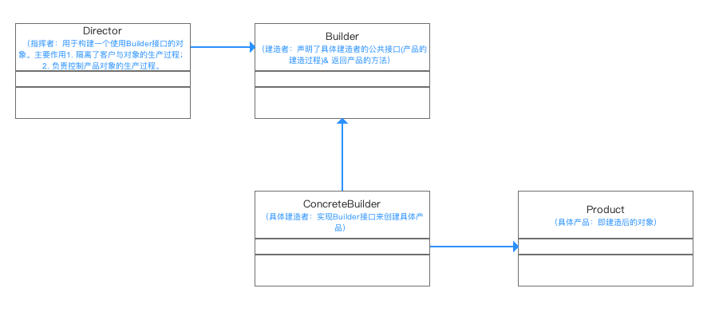

# Android设计模式-建造者模式

## 定义
将一个复杂对象的构建与它的表示分离，使得同样的构建过程可以创建不同的表示,使用多个简单的对象一步一步构建成一个复杂的对象

## 解决问题
>* 方便用户创建复杂的对象（不需要知道实现过程）
>* 将对象构建过程和细节进行封装 & 复用

## UML类图


## 角色分类
>* Director 导演类，告诉Builder开始创建对象。导演类起到了封装的作用，避免高层模块深入到建造者内部的实现。在建造者模式比较庞大时，导演类可以有多个。
>* Builder 抽象建造者类 规范产品的组建，一般由子类实现
>* ConcreteBuilder 具体建造者类，实现抽象类定义的所有方法，并返回一个组建好的对象
>* Product 产品类，具体要生产的对象

## 实例分析
* 背景：顾客去电脑城买一台组装的台式主机
* 过程：
电脑城老板（Diretor）和顾客（Client）进行需求沟通（玩游戏？学习？看片？）
了解需求后，电脑城老板将顾客需要的主机划分为各个部件（Builder）的建造请求（CPU、主板、硬盘）
* 安排装机人员（ConcreteBuilder）去组装电脑各个部件
* 将组件组装起来成顾客需要的电脑（Product）

### 实现步骤
步骤1：定义具体产品类（Product）：电脑
```
public class Computer{
    	//电脑组件的集合
    	private List<String> parts = new ArrayList<String>()；
    	//用于将组件组装到电脑里
    	public void Add(String part){
    	parts.add(part);
	}
    
    public void Show(){
          for (int i = 0;i<parts.size();i++){    
          System.out.println(“组件”+parts.get(i)+“装好了”);}
          System.out.println(“电脑组装完成，请验收”);
	}
}
```
步骤2： 定义组装的过程（Builder）：组装电脑的过程
```
public  abstract class Builder {  

    //第一步：装CPU
    //声明为抽象方法，具体由子类实现 
    public abstract void  BuildCPU()；

     //第二步：装主板
   	//声明为抽象方法，具体由子类实现 
    public abstract void BuildMainboard（）；

	//第三步：装硬盘
	//声明为抽象方法，具体由子类实现 
    public abstract void BuildHD（）；

	//返回产品的方法：获得组装好的电脑
    public abstract Computer GetComputer（）；
}
```
步骤3：创建具体的建造者（ConcreteBuilder）:装机人员
```
//装机人员1
  public class ConcreteBuilder extend  Builder{
    //创建产品实例
    Computer computer = new Computer();

    //组装产品
    @Override
    public void  BuildCPU(){  
       computer.Add("组装CPU")
    }  

    @Override
    public void  BuildMainboard（）{  
       computer.Add("组装主板")
    }  

    @Override
    public void  BuildHD（）{  
       computer.Add("组装主板")
    }  

    //返回组装成功的电脑
     @Override
      public  Computer GetComputer（）{  
      return computer
    }  
}
```

步骤4： 电脑城老板委派任务给装机人员（Director）
```
public class Director{
     //指挥装机人员组装电脑
     public void Construct(Builder builder){                    
      	builder.BuildCPU();
      	builder.BuildMainboard（）;
      	builder.BuildHD（）;
     }
 }
 ```
 步骤5：客户端调用-顾客到电脑城找老板买电脑
 ```
 public class Builder Pattern{
 	 public static void main(String[] args){
	//逛了很久终于发现一家合适的电脑店
	//找到该店的老板和装机人员
 	 Director director = new Director();
  	 Builder builder = new ConcreteBuilder();

	//沟通需求后，老板叫装机人员去装电脑
	director.Construct(builder);

	//装完后，组装人员搬来组装好的电脑
	Computer computer = builder.GetComputer();
	//组装人员展示电脑给小成看
	computer.Show()；
    }     
}
```
## 总结
### 应用场景
> * 需要生成的产品对象有复杂的内部结构，这些产品对象具备共性
> * 隔离复杂对象的创建和使用，并使得相同的创建过程可以创建不同的产品
### 优点
>* 易于解耦
将产品本身与产品创建过程进行解耦，可以使用相同的创建过程来得到不同的产品。也就说细节依赖抽象。
>* 易于精确控制对象的创建
将复杂产品的创建步骤分解在不同的方法中，使得创建过程更加清晰
>* 易于拓展
增加新的具体建造者无需修改原有类库的代码，易于拓展，符合“开闭原则“
### 缺点
>* 建造者模式所创建的产品一般具有较多的共同点，其组成部分相似；如果产品之间的差异性很大，则不适合使用建造者模式，因此其使用范围受到一定的限制。
>* 如果产品的内部变化复杂，可能会导致需要定义很多具体建造者类来实现这种变化，导致系统变得很庞大。
