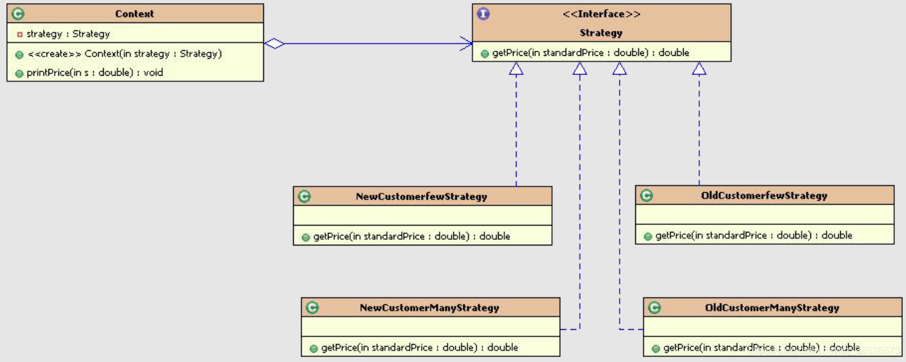

# 设计模式之策略模式

### 定义：

定义一系列的算法，把每一个算法封装起来,并且使它们可相互替换。策略模式模式使得算法可独立于使用它的客户而独立变化

- 策略模式属于行为型模式。
- 策略模式提供了一组算法给客户端调用，使得客户端能够根据不同的条件来选择不同的策略来解决不同的问题。
- 如排序算法，可以使用冒泡排序、快速排序等等。

### 场景：

##### 某个市场人员接到单后的报价策略：

- 普通客户小批量报价--->>不打折，原价
- 普通客户大批量报价--->>打九折
- 老客户小批量报价 --->> 打八五折
- 老客户大批量报价 --->> 打八折
- ...


##### 简单程序处理方式：各种if-else判断语句：

```javascript
public double getPrice(String type, double price) {
	if (type.equals("普通客户小批量")) {
		System.out.println("不打折,原价");
		return price;
	} else if (type.equals("普通客户大批量")) {
		System.out.println("打九折");
		return price * 0.9;
	} else if (type.equals("老客户小批量")) {
		System.out.println("打八五折");
		return price * 0.85;
	} else if (type.equals("老客户大批量")) {
		System.out.println("打八折");
		return price * 0.8;
	}
	return price;
}
```

##### 缺点：

- 判断逻辑使用太多，if-else语句太多，逻辑相对来说不太友好，后期维护成本较高
- 可维护性，拓展性都不太理想


### 策略模式处理：

###### 类图：



##### 角色说明：

- Stragety(抽象策略类)：抽象类或接口，提供具体策略类需要实现的接口。
- ConcreteStragetyA、ConcreteStragetyB（具体策略类）：具体的策略实现，封装了相关的算法实现。
- Context（环境类）：用来操作策略的上下文环境。

###### Strategy接口：

```javascript
public interface Strategy {
	public double getPrice(double  standardPrice);
}
```


###### 四种算法实现：

普通客户小批量报价--->>不打折，原价

```javascript
public class NewCustomerFewStrategy implements Strategy {
	@Override
	public double getPrice(double standardPrice) {
		System.out.println("不打折，原价");
		return standardPrice;
	}
}
```


普通客户大批量报价--->>打九折

```javascript
public class NewCustomerManyStrategy implements Strategy {
	@Override
	public double getPrice(double standardPrice) {
		System.out.println("打九折");
		return standardPrice*0.9;
	}
}
```


老客户小批量报价 --->> 打八五折

```javascript
public class OldCustomerFewStrategy implements Strategy {
	@Override
	public double getPrice(double standardPrice) {
		System.out.println("打八五折");
		return standardPrice*0.85;
	}
}
```


老客户大批量报价 --->> 打八折

```javascript
public class OldCustomerManyStrategy implements Strategy {
	@Override
	public double getPrice(double standardPrice) {
		System.out.println("打八折");
		return standardPrice*0.8;
	}
}
```


###### 对外统一出口

```javascript
/**
 * 负责和具体的策略类交互
 * 这样的话，具体的算法和直接的客户端调用分离了，使得算法可以独立于客户端独立的变化。
 * @author Administrator
 *
 */
public class Context {
	//当前采用的算法对象
	private Strategy strategy;	

	//可以通过构造器来注入
	public Context(Strategy strategy) {
		super();
		this.strategy = strategy;
	}
	//可以通过set方法来注入
	public void setStrategy(Strategy strategy) {
		this.strategy = strategy;
	}
	public void pringPrice(double s){
		System.out.println("您该报价："+strategy.getPrice(s));
	}
}
```


###### 使用：

```javascript
public static void main(String[] args) {
	Strategy s1 = new OldCustomerManyStrategy();
	Context ctx = new Context(s1);
	ctx.pringPrice(998);
}
```

###### 输出：

```javascript
打八折
您该报价：798.4000000000001
```

### 案例总结：

​		通过案例我们能清楚的看到，如果我们想要添加新的算法只需要再单独添加Strategy的实现就可以了，和其他算法没有影响。移除是也同样的道理，而且和客户端实现了分离


### Android中使用策略模式的例子：

我们用的ListView时都需要设置一个Adapter，而这个Adapter根据我们实际的需求可以用ArrayAdapter、SimpleAdapter等等，这里就运用到策略模式。

###### ListView简单用法：

```java
//使用ArrayAdapter
    listView.setAdapter(new ArrayAdapter<String>(this,R.id.item,new String[] {"one","two"}));
```

###### 源码分析：

```java
  public class ListView extends AbsListView {//相当于环境类
        @Override
        public void setAdapter(ListAdapter adapter) {//设置策略，即adapter
            //其他代码略
        }
    }

		//抽象策略接口
    public interface ListAdapter extends Adapter {
    }

		//具体策略类BaseAdapter，实现ListAdapter接口
    public abstract class BaseAdapter implements ListAdapter, SpinnerAdapter {
    }

		//具体策略类ArrayAdapter，继承BaseAdapter，即实现ListAdapter接口
    public class ArrayAdapter<T> extends BaseAdapter implements Filterable, 			    	   ThemedSpinnerAdapter {
        
    }
```

### 总结

- 通过设置不同的`Adapter`（即不同的策略），我们就可以写出符合我们需求的`ListView`布局。
- 另外，动画中的插值器（`ValueAnimator` 的 `setInterpolator` 方法）也是有运用到策略模式，有兴趣的可以去看下。


### 策略模式优点：

- 策略类可以互相替换
  由于策略类都实现同一个接口，因此他们能够互相替换。

- 耦合度低，方便扩展
  增加一个新的策略只需要添加一个具体的策略类即可，基本不需要改变原有的代码，符合**开闭原则**。

- 避免使用多重条件选择语句（if-else或者switch）

### 策略模式缺点：

- 策略的增多会导致子类的也会变多
- 客户端必须知道所有的策略类，并自行决定使用哪一个策略类。

### 使用场景

策略模式它实质上就是面向对象中的继承和多态，在以下两种情况下，可以考虑使用策略模式：

- 几个类的主要逻辑相同，只在部分逻辑的算法和行为上稍有区别的情况。
- 有几种相似的行为，或者说算法，客户端需要动态地决定使用哪一种，那么可以使用策略模式，将这些算法封装起来供客户端调用。


