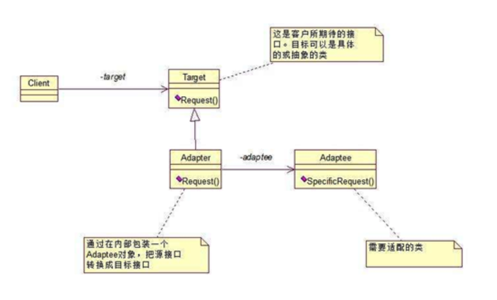

# 适配器模式
## 定义
适配器模式（Adapter）：将一个类的接口转换成客户希望的另外一个接口。Adapter 模式使得原本由于接口不兼容而不能一起工作的那些类可以一起工作。
## 使用场景
>* 已经存在的类的接口不符合我们的需求； 
>* 创建一个可以复用的类，使得该类可以与其他不相关的类或不可预见的类（即那些接口可能不一定兼容的类）协同工作； 
>* 在不对每一个都进行子类化以匹配它们的接口的情况下，使用一些已经存在的子类。 

其实现方式主要有两种：
 1.类的适配器模式（采用继承实现）
 2.对象适配器（采用对象组合方式实现）
 
 本次讲解以类的适配器模式讲解,对象适配器实现方式自行学习。
## 角色
>* Target（目标抽象类）：目标抽象类定义客户所需接口，可以是一个抽象类或接口，也可以是具体类。
>* Adapter（适配器类）：适配器可以调用另一个接口，作为一个转换器，对Adaptee和Target进行适配，适配器类是适配器模式的核心，在对象适配器中，它通过继承Target并关联一个Adaptee对象使二者产生联系。
>* Adaptee（适配者类）：适配者即被适配的角色，它定义了一个已经存在的接口，这个接口需要适配，适配者类一般是一个具体类，包含了客户希望使用的业务方法，在某些情况下可能没有适配者类的源代码。

## 类图


## 优缺点
优点
>* 将目标类和适配者类解耦，通过引入一个适配器类来重用现有的适配者类，无须修改原有结构。
>* 增加了类的透明性和复用性，将具体的业务实现过程封装在适配者类中，对于客户端类而言是透明的，而且提高了适配者的复用性，同一个适配者类可以在多个不同的系统中复用。
>* 灵活性和扩展性都非常好，通过使用配置文件，可以很方便地更换适配器，也可以在不修改原有代码的基础上增加新的适配器类，完全符合“开闭原则”。
>* 由于适配器类是适配者类的子类，因此可以在适配器类中置换一些适配者的方法，使得适配器的灵活性更强。

缺点：
>* 对于Java、C#等不支持多重类继承的语言，一次最多只能适配一个适配者类，不能同时适配多个适配者；
>* 适配者类不能为最终类，如在Java中不能为final类，C#中不能为sealed类；
>* 在Java、C#等语言中，类适配器模式中的目标抽象类只能为接口，不能为类，其使用有一定的局限性。

## 实现
首先有一个已存在的将被适配的类
```
public class Adaptee {
    public void adapterRequest() {
       System.out.println("被适配者的方法");
    }
}
```

定义一个目标接口 
```
public interface Target {
    void request();
} 
```
怎么才可以在目标接口中的 request() 调用 Adaptee 的 adapteeRequest() 方法呢？
如果直接实现 Target 是不行的
```
public class ConcreteTarget implements Target {
    @Override
    public void request() {
        System.out.println("concreteTarget目标方法");
    }
} 
```

如果通过一个适配器类，实现 Target 接口，同时继承了 Adaptee 类，然后在实现的 request() 方法中调用父类的 adapteeRequest() 即可实现

```
public class Adapter extends Adaptee implements Target{
    @Override
    public void request() {
        //...一些操作...
        super.adapteeRequest();
        //...一些操作...
    }
} 

```

测试一下

```
public class Test {
    public static void main(String[] args) {
        Target target = new ConcreteTarget();
        target.request();

        Target adapterTarget = new Adapter();
        adapterTarget.request();
    }
}

```